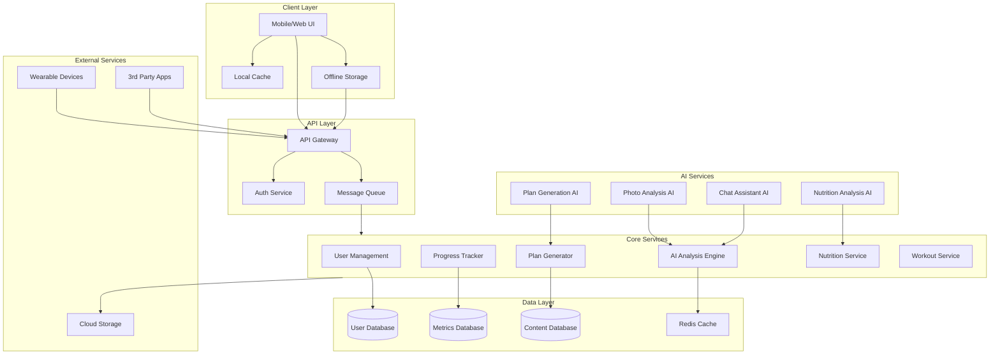

```mermaid
graph TB
    subgraph Client["Client Layer"]
        UI["Mobile/Web UI"]
        Cache["Local Cache"]
        Offline["Offline Storage"]
    end

    subgraph API["API Layer"]
        Gateway["API Gateway"]
        Auth["Auth Service"]
        Queue["Message Queue"]
    end

    subgraph Core["Core Services"]
        UserMgmt["User Management"]
        PlanGen["Plan Generator"]
        Progress["Progress Tracker"]
        AIAnalysis["AI Analysis Engine"]
        Nutrition["Nutrition Service"]
        Workout["Workout Service"]
    end

    subgraph AI["AI Services"]
        PhotoAI["Photo Analysis AI"]
        ChatAI["Chat Assistant AI"]
        PlanAI["Plan Generation AI"]
        NutritionAI["Nutrition Analysis AI"]
    end

    subgraph Data["Data Layer"]
        UserDB[(User Database)]
        MetricsDB[(Metrics Database)]
        ContentDB[(Content Database)]
        Cache2["Redis Cache"]
    end

    subgraph External["External Services"]
        Wearables["Wearable Devices"]
        ThirdParty["3rd Party Apps"]
        CloudStorage["Cloud Storage"]
    end

    %% Client Layer Connections
    UI --> Gateway
    UI --> Cache
    UI --> Offline
    Offline --> Gateway

    %% API Layer Connections
    Gateway --> Auth
    Gateway --> Queue
    Queue --> Core

    %% Core Service Connections
    UserMgmt --> UserDB
    PlanGen --> ContentDB
    Progress --> MetricsDB
    AIAnalysis --> Cache2

    %% AI Service Connections
    PhotoAI --> AIAnalysis
    ChatAI --> AIAnalysis
    PlanAI --> PlanGen
    NutritionAI --> Nutrition

    %% External Service Connections
    Wearables --> Gateway
    ThirdParty --> Gateway
    Core --> CloudStorage
```