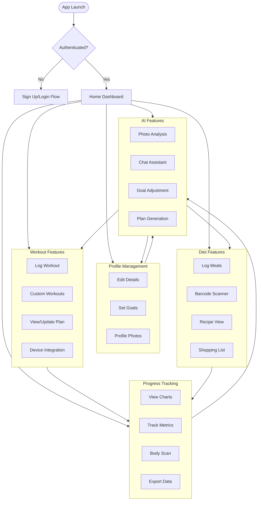

```mermaid
flowchart TD
    Start([App Launch]) --> Auth{Authenticated?}
    Auth -->|No| SignUp[Sign Up/Login Flow]
    Auth -->|Yes| Home[Home Dashboard]

    Home --> Profile[Profile Management]
    Home --> Workout[Workout Features]
    Home --> Diet[Diet Features]
    Home --> Progress[Progress Tracking]
    Home --> AI[AI Features]

    subgraph Profile["Profile Management"]
        ProfileDetails[Edit Details]
        Goals[Set Goals]
        Photos[Profile Photos]
    end

    subgraph Workout["Workout Features"]
        Log[Log Workout]
        Custom[Custom Workouts]
        Plan[View/Update Plan]
        Device[Device Integration]
    end

    subgraph Diet["Diet Features"]
        MealLog[Log Meals]
        Scanner[Barcode Scanner]
        Recipe[Recipe View]
        Shopping[Shopping List]
    end

    subgraph Progress["Progress Tracking"]
        Charts[View Charts]
        Metrics[Track Metrics]
        BodyScan[Body Scan]
        Export[Export Data]
    end

    subgraph AI["AI Features"]
        Analysis[Photo Analysis]
        Assistant[Chat Assistant]
        Adjust[Goal Adjustment]
        Generate[Plan Generation]
    end

    %% Feature Interactions
    Profile --> AI
    Workout --> Progress
    Diet --> Progress
    Progress --> AI
    AI --> Profile
    AI --> Workout
    AI --> Diet
```